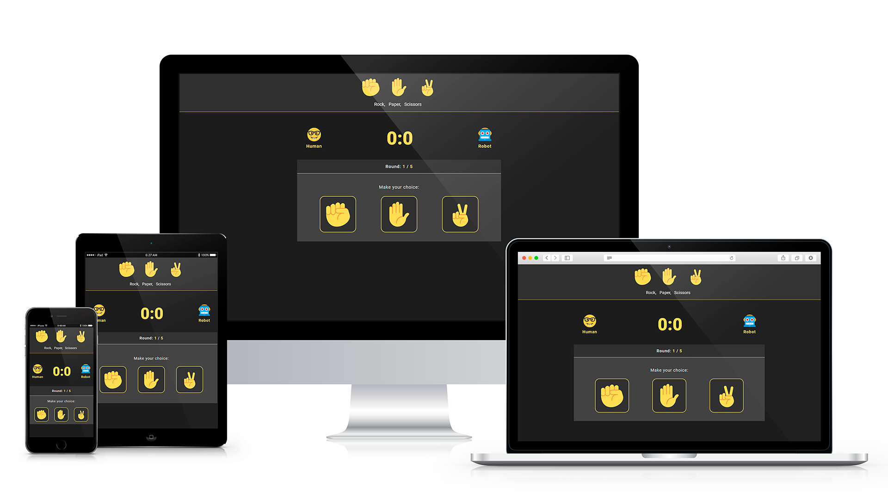

# WBS Coding School Groupwork
## The Game - Roshambo (Rock Paper Scissors) 
## :fist: :hand: :v:

## :tada: Group Members :beer:
Davide, Zee, J

This project reproduce the game of Roshambo (Rock Paper Scissors).

The game is created and coded with javascript, we also added a nice ux interface with html and css.

The Game starts with the choose of the name of the first player, and the scope of the game is to win against the computer (robot). The Game will be done in 3 rounds.
We hope you will have fun to play with it.

best,
Davide, Zee, J.

